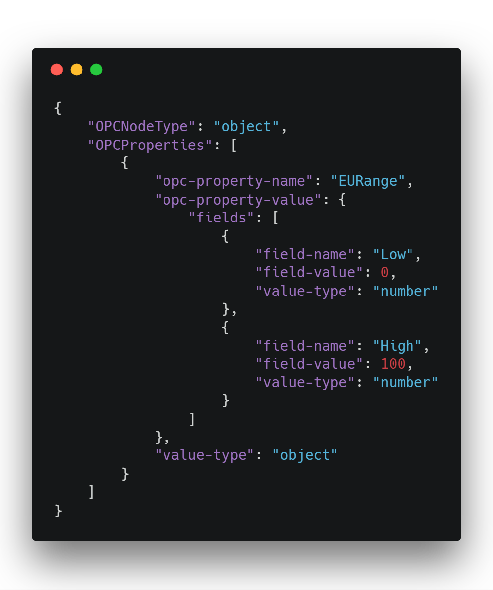

# Mapping between OPC UA and OCF information models

## Introduction
Since few years, Industry has been featured by a revolution, the fourth one, which has been coined with different names in different countries; the most known is Industry 4.0. 
One of the main goal of the Industry 4.0 is the interoperability of industrial applications and the use of enabling ICT technologies, mainly those based on the IoT. This goal may be reached through integration of different communication systems used in the current Industry 4.0 and IoT scenarios. For this reason, during these last years, several solutions dealing with the integration of OPC UA and IoT ecosystems appeared in the literature, due to important role played by OPC UA inside the current Industry 4.0 reference models (see for example the [RAMI4.0](https://www.zvei.org/fileadmin/user_upload/Themen/Industrie_4.0/Das_Referenzarchitekturmodell_RAMI_4.0_und_die_Industrie_4.0-Komponente/pdf/5305_Publikation_GMA_Status_Report_ZVEI_Reference_Architecture_Model.pdf) and [IIRA](https://www.iiconsortium.org/IIC_PUB_G1_V1.80_2017-01-31.pdf) reference architectures which both indicate OPC UA as one of the main connectivity standard on Industry 4.0).
The research group at University of Catania, DIEEI, has recently proposed a novel solution to make interoperable OPC UA and IoT ecosystems; some preliminary results have been presented [here](https://ieeexplore.ieee.org/document/8387649/) and [here](https://ieeexplore.ieee.org/document/8352412). Among the current IoT ecosystems, OCF has been chosen for the integration with OPC UA, as it seems a promising solution to standardise the exchange of information into IoT. It is important to point out that no other solutions of interoperability between OPC UA and OCF are present in the current literature. 

## Research goal
Interoperability between OPC UA and OCF has been realised in both direction. Considering the interoperability from OPC UA to OCF, the proposal is based on the idea to make available information maintained by an OPC UA Server to whatever IoT devices compliant with OCF specifications. This is realised through the ad-hoc definition of a new OCF Device Type, called in the paper “x.opc.device”. According to the solution here presented, each information maintained by an OPC UA Server may be mapped into an OCF Device of “x.opc.device” type; acting as a server, this device may expose this information to whatever client devices in the OCF ecosystem. 
Figure 1 gives a graphical representation of the proposed solution. As it can be seen on the left of the figure, the OCF ecosystem is present with several OCF Devices exchanging information though OCF communication protocol. As shown, in the OCF ecosystem it is assumed the presence of at least an OCF Device of “x.opc.device” type. On the right side, the OPC UA ecosystem is shown, made up by OPC UA Servers and one or more OPC UA Clients and Subscribers. The arrow from the OPC UA Server to the OCF Device of “x.opc.device” type represents the information flow needed to populate this last device with the information maintained by the OPC UA Server. Information flow is realised on the basis of the mapping defined in the research carried out by the research group at University of Catania (DIEEI) and presented in the remainder of this paper. The mapping specifies how each element of the OPC UA AddressSpace is mapped in the correspondent element of the OCF Resource Model inside the OCF Device of “x.opc.device” type.
It is important to point out that the proposal involves only the mapping rules from OPC UA to OCF information models. Details about how each information from OPC UA Server is actually transferred to the OCF Device of “x.opc.device” type (e.g., communication protocols and services used to realise the mapping) are outside the scope of the research carried on.


Considering the interoperability from OCF to OPC UA, the solution proposed aims to realise a mapping from OCF Resource Model to OPC UA AddressSpace. The mapping specifies how each element of the OCF Resource Model is mapped in the correspondent element of the OPC UA AddressSpace of an OPC UA Server. Through this mapping, information maintained by a generic OCF Device may be published by an OPC UA Server making this information available to whatever OPC UA Client connected with the OPC UA Server. According to the recent OPC UA PubSub specification, the OPC UA Server may act as a Publisher allowing each OPC UA Subscriber to receive information coming from OCF ecosystem, as shown by Figure 1. The arrow from the OCF Device to the OPC UA Server represents the information flow needed to populate the AddressSpace of the OPC UA Server with the information maintained by the OCF Device. Information flow is realised on the basis of the mapping here defined. Again, details about how each information from an OCF Device to the OPC UA Server is actually transferred are outside the scope of the research carried on.
At the moment, this repository contains documents about the mapping from OPC UA to OCF; in the next future it will be completed adding documents about mapping in the other direction.

# Mapping from OPC UA to OCF

Mapping from OPC UA may involve the entire OPC UA AddressSpace of a specific OPC UA Server or its subset. As said before, the proposal is based on the use of an OCF Device belonging to the ad-hoc defined **“x.opc.device”** Device Type. Such Device is made up by several OCF Resources which may be related each other by OCF Links. OCF Resources are aimed to model OCP UA Nodes and belongs to one of three ad-hoc defined Resource Types: **“x.opc.object”**, **“x.opc.datavariable”** and **“x.opc.method”**, described in the following.


## "x.opc.device" Device Type

The **“x.opc.device”** Device Type has been defined to represent the environment where the elements of OPC UA AddressSpace (or its subset) are mapped. A Device of this type shall expose a mandatory OCF Resource of the **“x.opc.object”** Resource Type named *“AddressSpaceSubset”*. It aims to aggregate OCF Resources mapping OPC UA Nodes. 

## OCF Resource Types defined

The repository contains the JSON Schema relevant to the three ad-hoc defined OCF Resource Types **“x.opc.object”**, **“x.opc.datavariable”** and **“x.opc.method”**. 

The OCF Resource Types defined extend the “oic.core” OCF Resource Type. For this reason, each Resource representing an OPC UA Node contains the OCF common properties filled as follows: 
- Name “n” property is filled using the OPC UA attribute DisplayName,
- Resource Type (“rt”) property is filled with the name of the Resource Type used to represent the Resource (i.e.  **“x.opc.object”**, **“x.opc.datavariable”** and **“x.opc.method”**),
- Identifier of the Resource (“id”) property is filled using a string representation of the OPC UA NodeId of the mapped Object Node, made up by the concatenation of the value ns (NamespaceIndex) and value i (Identifier) separated by a dash; for example, the NodeId made up by ns=2 and i=12 becomes “2-12”.

### "x.opc.object" Resource Type
The “x.opc.object” Resource Type has been defined to map OPC UA Object Nodes of any ObjectType (including FolderType). 
In addition to the OCF common properties, a Resource belonging to the “x.opc.object” Resource Type exposes several properties, described in the following table.

| Property Name | OCF data type | Mandatory | Description
| ------------- | ------------- | ------------- | ------------- |
|  Common properties  | | | Properties defined by "oic.core" Resource Type|
| OPCNodeType  | string  | Yes | It specifies if the Resource represents an OPC UA Node of ObjectType or FolderType type|
| OPCDescription  | string  | No | It maps the Description attribute of the OPC UA Object Node represented|
| OPCProperties  | array of objects  | No | An array of JSON objects representing the OPC UA Property Nodes of the OPC UA Object Node represented|
| links  | string  | array of OCF Links | An array of OCF Links mapping OPC UA OPC UA Organizes and HasComponent References|

*OPCProperties* is defined as an array of JSON objects. Each JSON object mapping an OPC UA Property Node, named **OPCPropertyObject**, is made up by the property defined in the following table.

| Property Name | OCF data type | Mandatory | Description
| ------------- | ------------- | ------------- | ------------- |
|  Common properties  | | | Properties defined by "oic.core" Resource Type|
| opc-property-name  | string  | Yes | It contains the BrowseName attribute of the OPC UA Property Node|
| opc-property-value  | \<type>  | Yes | \<type> represents the OCF data type mapping the OPC UA DataType of Value attribute of the OPC UA Property Node. The property contains the representation of the Value attribute of OPC UA Property Node according to the \<type>. Only in the case of OPC UA Property with attribute Value of array type, the \<type> is the OCF data type array. In this case, the OCF data type of each element of the array is given by the *innermost-type* property and this property contains an array.|
| value-type  | string  | Yes | It specifies the OCF data type used for the representation of the Value attribute of OPC UA Property Node. In case of attribute Value of array type, this property specifies OCF array data type.|
| enum-values  | array of objects  | No | Array of JSON objects each containing the enumeration values. It is present only if the Value attribute of the mapped OPC UA Property Node is of Enumeration DataType; in this case \<type> is number and *opc-property-value* represents the integer representation of the enumeration.|
| num-dimensions  | array of number  | No | It is present only if \<type> is array and it specifies the relevant dimensions.|
| innermost-type  | string  | No | It is present only if \<type> is array and it contains the OCF data type mapping the OPC UA DataType of each element of the array.|

If the Value attribute of the OPC UA Property Node is an enumeration, the optional *enum-values* property contains an array of JSON objects each containing the enumeration values. Each object is made up by the attributes described in the following table.

| Property Name | OCF data type | Mandatory | Description
| ------------- | ------------- | ------------- | ------------- |
| enumeration-index | number | Yes | The integer representation of an Enumeration |
| enumeration-value | string | Yes | A human-readable representation of the Value of the Enumeration |

### "x.opc.datavariable" Resource Type
OPC UA DataVariable Nodes are mapped as instances of the “x.opc.datavariable” OCF Resource Type. In addition to the OCF common properties, a Resource belonging to the “x.opc.datavariable” Resource Type exposes several properties, described in the following table.

| Property Name | OCF data type | Mandatory | Description
| ------------- | ------------- | ------------- | ------------- |
|  Common properties  | | | Properties defined by "oic.core" Resource Type|
| OPCValue  | \<type>  | Yes | \<type> represents the OCF data type mapping the OPC UA DataType of Value attribute of the OPC UA DataVariable Node. The property contains the representation of the Value attribute of OPC UA DataVariable Node according to the \<type>. Only in the case of OPC UA Property with attribute Value of array type, the \<type> is the OCF data type array. In this case, the OCF data type of each element of the array is given by the *innermost-type* property and this property contains an array.|
| value-type  | string  | Yes | It specifies the OCF data type used for the representation of the Value attribute of OPC UA DataVariable Node. In case of attribute Value of array type, this property specifies OCF array data type.|
| enum-values  | array of objects  | No | Array of JSON objects each containing the enumeration values. It is present only if the Value attribute of the mapped OPC UA DataVariable Node is of Enumeration DataType; in this case \<type> is number and *OPCValue* represents the integer representation of the enumeration.|
| num-dimensions  | array of number  | No | It is present only if \<type> is array and it specifies the relevant dimensions.|
| innermost-type  | string  | No | It is present only if \<type> is array and it contains the OCF data type mapping the OPC UA DataType of each element of the array.|
| OPCProperties  | array of objects  | No | An array of JSON objects representing the OPC UA Property Nodes of the OPC UA Object Node represented|
| links  | string  | array of OCF Links | An array of OCF Links mapping OPC UA OPC UA Organizes and HasComponent References|

If the Value attribute of the OPC UA DataVariable Node is an enumeration, the optional *enum-values* property contains an array of JSON objects each containing the enumeration values. Each object is made up as described for **OPCPropertyObject**.

### "x.opc.method" Resource Type
OPC UA Method Nodes are mapped as instances of the “x.opc.method” OCF Resource Type. In addition to the OCF common properties, a Resource belonging to the “x.opc.method” Resource Type exposes several properties, described in the following table.

| Property Name | OCF data type | Mandatory | Description
| ------------- | ------------- | ------------- | ------------- |
|  Common properties  | | | Properties defined by "oic.core" Resource Type|
| OPCInputArg | array of objects | No | An array of JSON object representing the input arguments of the Method (i.e. OPCInputArg OPC Property Node). |
| OPCOutputArg | array of objects | No | An array of JSON object representing the output arguments of the Method (i.e. OPCOutputArg OPC Property Node). |
| Executable | boolean | Yes | It is used to map the Executable and UserExecutable attributes of the OPC UA Method Node |
| OPCProperties  | array of objects  | No | An array of JSON objects representing the OPC UA Property Nodes of the OPC UA Object Node represented|
| links  | string  | array of OCF Links | An array of OCF Links mapping OPC UA OPC UA Organizes and HasComponent References|

### Mapping Value of OPC UA Variable Nodes

The following table contains the conversion rules among OPC UA, JSON and OCF data types.

| OPC UA DataType | JSON base type | OCF data type
| ------------- | ------------- | ------------- |
| **Built-in**: Integer, Float, Double, StatusCode| number | number |
| **Enumeration** |string | string |
| **Built-in**: Boolean| literal names (*true* and *false*) | boolean |
| **Built-in**: NodeId, ExpandedNodeId, DiagnosticInfo DataValue, Variant, ExtentionObject, LocalizedText, QualifiedName | object | object |
| **Structured**| object | object |
| **Array** | array | array |

The current value of the Value attribute of OPC UA Variable Node (both Property and DataVariable) is encoded according to the OCF data type and the value so obtained is assigned to the property *opc-property-value* in the case of OPC UA Property Node or to the property *OPCValue* in the case of OPC UA DataVariable Node. Particular cases occur when the Value attribute of OPC UA Variable belongs to OPC UA Enumeration or Structured DataTypes.
In case of Enumeration DataType, the property *enum-values* of an **OPCPropertyObject** and *x.opc.datavariable* Resource Type is filled with an array of JSON objects containing the enumeration values. Each JSON object in the array is made up by two properties named *enumeration-index* and *enumeration-value* as previously described.
In the case of Structured DataType, an ad-hoc JSON object has been defined to represent the original OPC UA Structured DataType. It is made up by only one property named *fields*. This property is an array of JSON objects, each of which models a single OPC UA Field of an OPC UA Structured DataType. Yhe following table describes all the properties of this JSON object.

| Property Name | OCF data type | Mandatory | Description
| ------------- | ------------- | ------------- | ------------- |
| field-name  | string  | Yes | It contains the Field Name value of the OPC UA Field |
| field-value  | \<type>  | Yes | \<type> represents the OCF data type mapping the OPC UA DataType specified by TypeName value of of the OPC UA Field. The property contains the representation of the current value of the OPC UA Field encoded according to the \<type>. Only in the case of attribute Value of array type, the \<type> is the OCF data type array. In this case, the OCF data type of each element is given by the *innermost-type* property and the property contains an array.|
| value-type  | string  | Yes | It specifies the OCF data type used for the the representation of current value of the OPC UA Field. In the case of attribute Value of array type, this property specifies OCF array data type.|
| enum-values  | array of objects  | No |An array of JSON objects each containing the enumeration values. It is present only if the OPC UA Field Value is of Enumeration DataType; in this case \<type> is number and “field-value” represents the integer representation of the enumeration.|
| num-dimensions  | array of number  | No | It is present only if \<type> is array and it specifies the relevant dimensions.|
| innermost-type  | string  | No | It is present only if \<type> is array and it contains the OCF data type mapping the OPC UA DataType of each element of the array.|

As for example, the following JSON represent an OPC UA Object with a structured Property named EURange.



---

## Validate JSON with VS Code
This project has been created using **Visual Studio Code** and its native JSON Schema Validator in order to check JSON documents.

1. Clone this project using the following:

    ` git clone https://github.com/OPCUAUniCT/OPCUA-Resource-Types-for-OCF.git `

2. Open the cloned folder using VS Code. This project contains an hidden folder **.vscode** which contains a VS Code workspace setting.

```json
{
    "json.schemas": [
        {
            "fileMatch": [
                "esempio*.json"
            ],
            "url": "/schema/myopcobject.json"
        }
    ]
}
```
This setting says that every JSON file (any file with .json extension) with a name starting with "esempio" must be validated considering the JSON schema **myopcobject.json** in the *"schema"* folder.

3. Create a JSON file with "esempio" at the begin of its name (eg. esempio-1.json, esempioFoo.json, etc.) and start creating a resurce compliant to the schema. All the errors in the schema validation appear in "**Problems**" tab of the VS Code integrated terminal. 
